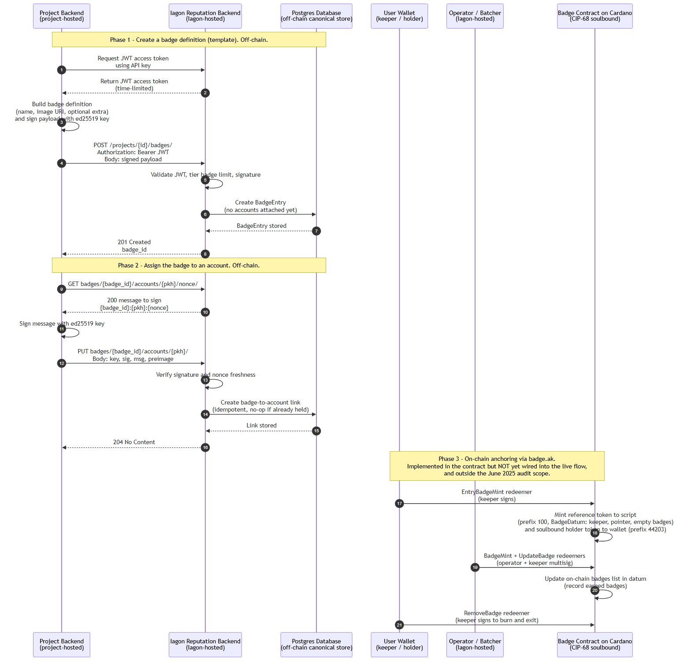

# Statur Badge Lifecycle

This document explains how badges work in Statur — from creating a badge definition, to awarding it to a user, to the on-chain soulbound representation provided by the badge smart contract. It is referenced from the Catalyst Milestone 2 evidence (`catalyst/fund12-milestone-2.md`).

Badges are one of the reputation categories in Statur. In Iagon's own score instantiation, the **Badges** category carries a weight of `0.07` (see the [score weights diagram](./diagrams/statur-iagon-score-weights.png)). A project defines its own badges and awards them to its users; each held badge contributes to the user's reputation score.

## Lifecycle at a glance

The lifecycle has three phases. **Phases 1 and 2 are live today** and run entirely off-chain through the reputation backend API. **Phase 3 is the on-chain anchoring** provided by the `badge.ak` contract — it is implemented in the contract layer but is **not yet wired into the live update flow**, and it was **outside the scope of the June 2025 audit** (which covered the reputation and fee scripts only).

- Source: [`diagrams/sequence-badge-lifecycle.mmd`](./diagrams/sequence-badge-lifecycle.mmd)
- Rendered: [`diagrams/sequence-badge-lifecycle.png`](./diagrams/sequence-badge-lifecycle.png)

## Phase 1 — Create a badge definition (off-chain)

`POST /api/v1/projects/{project_id}/badges/` creates a **badge definition** — effectively a template. The body is a signed payload (the project authenticates with a JWT derived from its API key and signs the payload with its ed25519 key). A badge definition holds:

- `name` — a human-readable badge name (unique per project),
- `image` — a URI for the badge image (http, https, ipfs, or data),
- `extra` — optional project metadata as a JSON object.

No accounts are attached at creation; holders are assigned later (Phase 2). The number of active badge definitions per project is bounded by the project's subscription tier.

## Phase 2 — Assign the badge to an account (off-chain)

Awarding a badge to a user is a two-step, project-signed flow:

1. `GET /api/v1/projects/{project_id}/badges/{badge_id}/accounts/{public_key_hash}/nonce/` returns a short-lived message of the form `{badge_id}:{public_key_hash}:{nonce}`.
2. The project signs that message with its ed25519 key and submits it via `PUT /api/v1/projects/{project_id}/badges/{badge_id}/accounts/{public_key_hash}/` with `{key, sig, msg, preimage}`.

The backend verifies the signature and nonce freshness, then **idempotently** creates the badge↔account relationship (a `204`; a no-op if the account already holds the badge). This relationship is stored in the off-chain canonical reputation store and is reflected in the account's score under the Badges category.

> **On-chain note:** badge awarding is currently recorded off-chain only. Badges are **not** part of the on-chain reputation hash payload that the batcher publishes for the reputation script.

## Phase 3 — On-chain anchoring via the badge contract

The badge smart contract (`badge.ak`, in the `iagon-reputation` repo) provides a verifiable, **soulbound (non-transferable)** on-chain representation of a user's badges, following the CIP-68 token pattern. It is parameterized by an Iagon-controlled `operator_pkh` and is governed by two roles:

- **keeper** — the user. Holds the soulbound holder token and must sign to enter, update (jointly), or remove their badge UTxO.
- **operator** — the Iagon backend hot key (the same operator concept used by the reputation script). Required to mint/burn badge entries and to co-sign updates.

It uses two token names per the CIP-68 convention: a **reference token** (`prefix_100`) locked at the script with the `BadgeDatum { keeper, pointer, badges }`, and a **soulbound holder token** (`prefix_44203`) sent to the user's wallet.

### Contract actions

| Action | Redeemer | Who signs | Effect |
|---|---|---|---|
| Enter | `EntryBadgeMint` (mint) | keeper (user) | Mints the reference token to the script and the soulbound holder token to the user's wallet, with an empty `badges` list in the datum. Keeper-only because the entry state is fully on-chain verifiable. |
| Award / change | `BadgeMint` (mint) + `UpdateBadge` (spend) | operator + keeper (multisig) | Records earned badges by updating the `badges` list in the on-chain datum, with datum continuity enforced. Operator participation reflects the off-chain (L2) data validation. |
| Remove | `RemoveBadge` (spend) | keeper (or operator as a fallback) | Burns all of the user's badge tokens and exits the contract. A user can remove their badges at any time. |

### How the contract plays into the lifecycle

Today, Phases 1–2 establish badges in the off-chain canonical store. The contract is the **future on-chain anchor** for those badges:

- A user would first **enter** the contract (`EntryBadgeMint`), creating their soulbound badge UTxO.
- The operator/batcher would then **record awarded badges** on-chain (`BadgeMint` + `UpdateBadge`) in a keeper+operator multisig, mirroring the operator-driven model already audited for the reputation script.
- The user retains control: they can **remove** their badges (`RemoveBadge`) without operator involvement.

This preserves the same trust model as the reputation script — Iagon's operator key authorizes state that is computed off-chain, while the on-chain tokens remain soulbound and user-removable — and it is the natural follow-on once badge minting is wired into the batcher and brought into a future audit pass.

## API reference

| Method & path | Purpose |
|---|---|
| `POST /api/v1/projects/{project_id}/badges/` | Create a badge definition |
| `GET /api/v1/projects/{project_id}/badges/` | List a project's badges |
| `GET /api/v1/projects/{project_id}/badges/{badge_id}/` | Retrieve a badge (public representation) |
| `PATCH /api/v1/projects/{project_id}/badges/{badge_id}/` | Update `name` / `image` / `extra` only |
| `GET .../badges/{badge_id}/accounts/{public_key_hash}/nonce/` | Get the message to sign for assignment |
| `PUT .../badges/{badge_id}/accounts/{public_key_hash}/` | Assign badge to account (idempotent) |
| `GET .../badges/{badge_id}/accounts/` | List accounts holding a badge |
| `GET /api/v1/accounts/{public_key_hash}/badges/` | List badges held by an account |
| `GET .../badges/{badge_id}/audit/` | Per-badge audit log |

See the live, self-contained spec: [`Iagon Reputation Backend API v0.11.0.yaml`](./Iagon%20Reputation%20Backend%20API%20v0.11.0.yaml) and the [Swagger UI](https://reputation-backend.cfs1.iagon.com/api/docs/).
