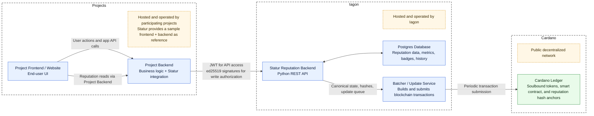

# Statur High-Level Architecture

This architecture diagram provides a system-level overview of Statur and its interaction with participating projects. It highlights the clear separation of responsibilities between project-hosted systems and Iagon-hosted Statur components. Project frontends and backends integrate with Statur using authenticated and signed API calls, while Iagon operates the reputation backend, database, and batcher service. The batcher periodically publishes cryptographic hashes of users’ reputation states to the public Cardano blockchain, ensuring on-chain verifiability without relying on Iagon as a trusted party.

