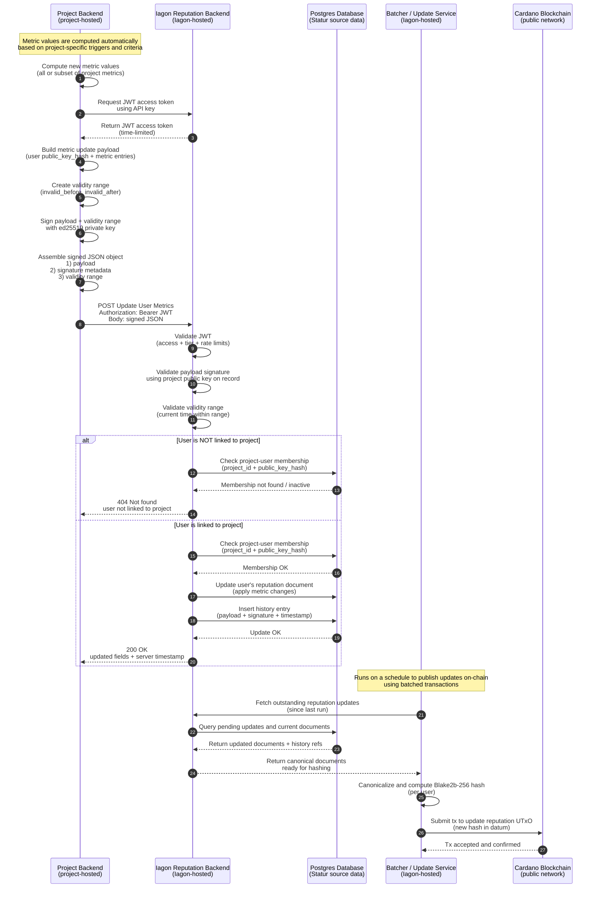

# User Metric Update and Reputation Publication Flow

This sequence diagram describes how a project updates the reputation metrics of an already-linked user. Metric values are calculated automatically by the project backend based on project-specific triggers or criteria and are signed using the same cryptographic mechanism as metric definitions. The Statur reputation backend validates authentication, signature integrity, and project–user linkage before applying the update to the user’s reputation document and recording the signed update in the user’s reputation history. On a scheduled basis, the batcher service aggregates outstanding updates, computes the canonical reputation hash, and publishes the updated hash to the Cardano blockchain, ensuring verifiable and cost-efficient on-chain synchronization.

